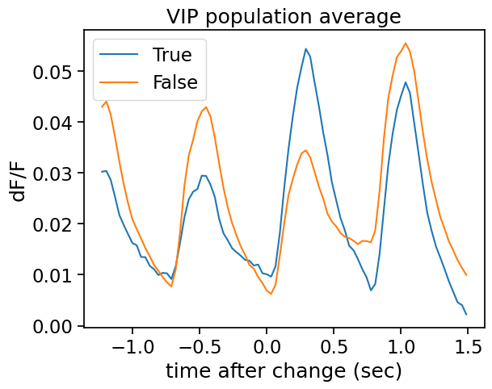

# Neural Responses to Reward and Stimulus Novelty in Mouse Visual Cortex

---

## Abstract

Reward and stimulus novelty are key factors modulating neural activity in sensory cortices. This study investigates how reward influences firing rates of excitatory, SST inhibitory, and VIP inhibitory neurons in the primary visual cortex (V1) of mice during a visual change detection task. Using the Allen Institute’s Visual Behavior 2P dataset, we analyzed neural activity under active task engagement (rewarded) versus passive viewing (non-rewarded), across both familiar and novel visual stimuli.

Population-level analyses, statistical comparisons, and omission trials were analyzed to assess neuronal dynamics. VIP and SST interneurons displayed distinct responses to reward and novelty. These findings provide insight into how cortical circuits encode reward and stimulus salience, although limitations include a focus solely on V1 and absence of data from regions like the hippocampus and amygdala. Behavioral metrics, including pupil size, running speed, and response latency, can further elucidate attention and motivation effects.

---

## Introduction

Reward and novelty strongly influence sensory processing in cortical circuits. Excitatory and inhibitory neurons exhibit distinct activity patterns depending on task engagement and stimulus familiarity. Inhibitory interneurons, particularly SST and VIP subtypes, play pivotal roles in shaping cortical activity:

- **SST cells** primarily inhibit distal dendrites of pyramidal neurons, modulating integration of visual input.
- **VIP cells** preferentially inhibit other interneurons, resulting in disinhibition of excitatory neurons and enhancing task-dependent responses.

Previous studies have shown that rewarded trials enhance neural activity and improve sensory representation fidelity. Novel stimuli evoke unique responses, reflecting experience-dependent plasticity.

The main goals of this study were:

1. To quantify how reward affects firing rates of VIP and SST neurons.
2. To examine differences in neural activity for novel versus familiar images.
3. To characterize responses during stimulus omission.
4. To provide population-level and statistical comparisons of rewarded versus non-rewarded conditions.

---

## Methods

The study utilized the Allen Visual Behavior 2P dataset, which includes 2-photon calcium imaging of neurons in mouse V1. Key data elements include:

- Fluorescence traces (delta F/F) aligned to stimulus onset.
- Mean and baseline responses in 500 ms windows.
- Trial metadata: reward status, stimulus novelty, and omission.
- Cell metadata: neuron type, imaging depth, cortical area, session, and mouse ID.

Population-level averages, statistical comparisons, and analyses of omission trials were performed to characterize how reward and novelty influence neuronal dynamics.

---

## Results

### 1. Firing Rates by Neuron Type and Task Engagement

Analysis revealed that VIP and SST cells show enhanced firing during rewarded trials, while excitatory neurons display moderate increases.

### 🔹 Bar plot of firing rates by neuron type and reward status.  

---

### 2. Relationship Between Response Latency and Running Speed

Response latency was moderately correlated with running speed, indicating that movement influences task performance.

### 🔹 Scatter plot of response latency versus mean running speed. 

---

### 3. Distribution of Rewarded Trials

A pie chart illustrates the proportion of rewarded versus non-rewarded trials, reflecting engagement variability.

### 🔹 Pie chart of rewarded trial distribution.  

---

### 4. VIP Cells – Novel Stimuli

VIP interneurons exhibit stronger responses during rewarded trials when exposed to novel images.

### 🔹 Line plot showing VIP population average for novel images.  

#### Statistical Comparison

Rewarded VIP trials had significantly higher mean responses compared to non-rewarded trials, highlighting the impact of motivation on interneuron activity.

### 🔹 Bar plot comparing VIP rewarded versus non-rewarded responses.  

---

### 5. SST Cells – Novel versus Familiar

SST neurons displayed stronger suppression for familiar images and more variable responses to novel images, consistent with their modulatory role in cortical circuits.

---

### 6. Responses to Stimulus Omission

#### SST Cells

Population average traces indicate modest activity changes during omitted trials.

#### VIP Cells

VIP neurons show distinct omission responses, with increased disinhibition during novel stimuli.

---

## Discussion

1. **Reward Effects:** Reward significantly enhances firing in VIP and SST neurons, supporting previous findings on motivation-driven neural modulation.
2. **Novelty Responses:** Novel stimuli induce stronger and more variable responses, highlighting experience-dependent plasticity.
3. **Omission Trials:** Both interneuron types respond to stimulus omission, reflecting predictive coding and expectation.
4. **Limitations:** Analyses were restricted to V1; other brain regions, including hippocampus or amygdala, were not examined. Behavioral covariates like pupil size and running speed could provide further insight into attention and motivation.

---

## Conclusion

Reward and stimulus novelty distinctly influence interneuron activity in mouse V1. Population-level analyses demonstrate that both VIP and SST neurons show enhanced responses during rewarded and novel trials. Responses to omitted stimuli provide further evidence for expectation-dependent modulation. These findings contribute to understanding how cortical circuits integrate reward and contextual information.

---

## Future Directions

- Longitudinal analysis of single-cell responses across sessions.
- Extend analyses to additional cortical and subcortical areas.
- Incorporate behavioral measures to investigate attention and task engagement.
- Apply machine learning approaches to predict trial outcomes based on neuronal activity.

---

## Dataset Access

The **Allen Visual Behavior 2P dataset** is publicly available and can be accessed through the following resources:

- [Dataset Overview and Access Portal](https://portal.brain-map.org/circuits-behavior/visual-behavior-2p)

- [AllenSDK Documentation for Data Access](https://allensdk.readthedocs.io/en/stable/visual_behavior_optical_physiology.html)

- [Technical White Paper on Dataset Methodology](https://brainmapportal-live-4cc80a57cd6e400d854-f7fdcae.divio-media.net/filer_public/4e/be/4ebe2911-bd38-4230-86c8-01a86cfd758e/visual_behavior_2p_technical_whitepaper.pdf)

These resources provide comprehensive information on dataset structure, experimental design, and guidelines for data analysis.

---

## References

1. Adesnik, H., Bruns, W., Taniguchi, H., Huang, Z. J., & Scanziani, M. (2012). *A neural circuit for spatial summation in visual cortex*. Nature, 490(7419), 226–231.
2. Pfeffer, C. K., Xue, M., He, M., Huang, Z. J., & Scanziani, M. (2013). *Inhibition of inhibition in visual cortex: The logic of connections between molecularly distinct interneurons*. Nature Neuroscience, 16(8), 1068–1076.
3. Poort, J., Khan, A. G., Pachitariu, M., Nemri, A., Orsolic, I., Krupic, J., ... & Roelfsema, P. R. (2015). *Learning enhances sensory and multiple non-sensory representations in primary visual cortex*. Neuron, 86(6), 1478–1490.
4. Pinto, L., & Dan, Y. (2015). *Cell-type-specific activity in prefrontal cortex during goal-directed behavior*. Neuron, 87(2), 437–450.
5. Keller, G. B., Bonhoeffer, T., & Hübener, M. (2012). *Sensorimotor mismatch signals in primary visual cortex of the behaving mouse*. Neuron, 74(5), 809–815.
